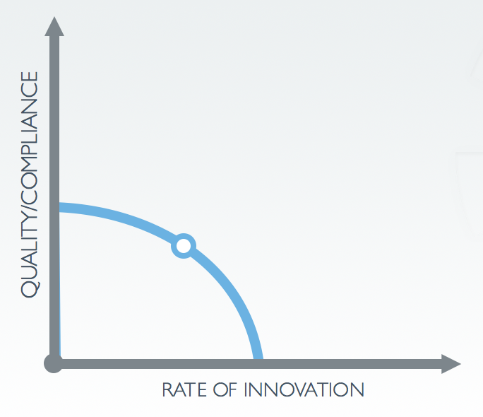

## Shifting Left Securely

---

# whoami

---

## Quality and innovation

## historically, a tradeoff

---

^ Stability is something that we attempt to ensure by reducing the vectors that can make changes to a system.

---

^ In practice, that means "deployments are executed by trusted individuals with admin access".

---

^ Just to be clear, my background is in system administration. This is not a "bag on the sysadmin" talk.

---

^ The problem with the "separation of duties" approach to solve all your stablity issues is that everyone can make mistakes. A job title doesn't imply infallibilty. Every sysadmin who thinks that they're title means won't make a mistake will tell me a story over a couple of pints about when they totally fucked up production.

---

^ It's also a huge burden on one group to be able to understand all the options and variance that steps in a "run book" will result in

---

^ What is "shifting left" anyway? The idea is that we move our testing further "to the left" in our pipeline. The closer to the introduction of the defect that it is discovered, the cheaper and easier it is to fix.

---

^ Of course, this introduces some challenges, right? I mean, if my tests don't pass, I can change the tests. Then the light is green and the trap is clean.

---

^ Take a page from the folks at Etsy. They have a high-trust culture, but that doesn't mean you don't test. I don't even trust myself to remember to test all the time.

---

^ We talk about treating your Infrastructure as code, etc. Your workflow should be treated as code too! Make sure your pipeline configuration is stored in version control, tested, and abstracted.

---

## Versioned

## Modularized

## Tested

^ If people care about what happens in something, they should be part of the pipeline approval.

---

## How does this help me with security?

---

^ Compliance and security are just another aspect of quality

---

^ This changes the physics of the whole thing. We can increase our rate of innovation, while becoming MORE compliant.

---

^ Oh boy, here comes the vendor pitch...

---

^ I'm not here to pitch products. Take from this what makes sense in your world, but let's think about this workflow and why it matters.

---
## To Review
- Treat your pipeline as code
- Trust (but verify) your domain experts
- Share the cooking
- Use your production audit tests in your pipeline
- Did I mention test?

---

# Questions?
---

##resources
- Sidney Dekker - *Field Guide to Human Error*
- github.com/mattstratton/shift-left-securely
- twitter.com/mattstratton
- speakerdeck.com/mattstratton
- arresteddevops.com
